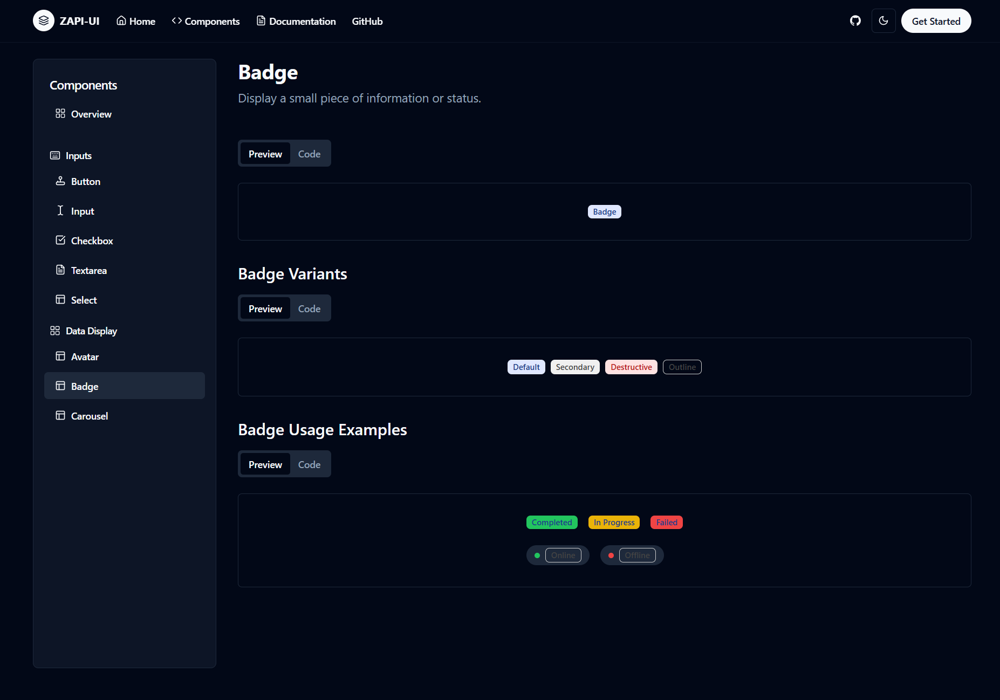
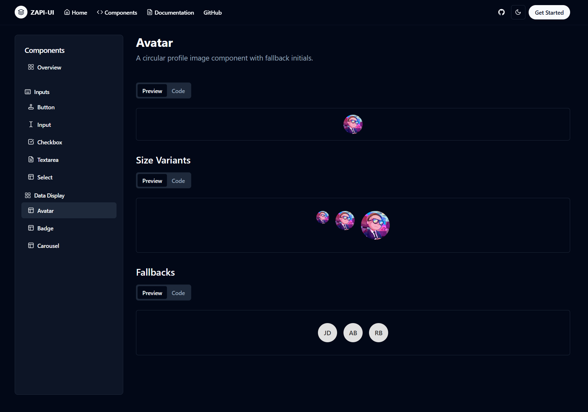
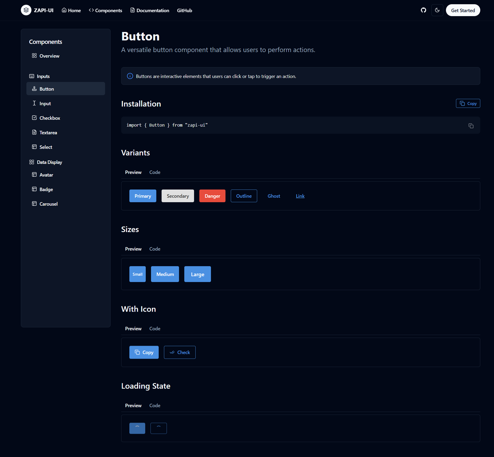

# ZAPI-UI

A customizable and accessible React UI component library built with plain CSS.

## 🌐 Reference

[ZAPI-UI Website](https://zapi-ui-website.vercel.app)

## 📸 Preview





## 📦 Installation

Install the package using npm or yarn:

```bash
npm install zapi-ui
# or
yarn add zapi-ui
```
## Import CSS

import 'zapi-ui/dist/index.css'; 

## 🚀 Usage

Import and use any component from the library:

```tsx
import { Checkbox } from 'zapi-ui';

function App() {
  const [checked, setChecked] = React.useState(false);

  return (
    <Checkbox
      checked={checked}
      onChange={(e) => setChecked(e.target.checked)}
      label="Accept Terms"
      description="Please accept the terms and conditions"
    />
  );
}
```

## ✨ Features

- Built with plain CSS – no dependency on Tailwind or other frameworks
- Accessible and keyboard-friendly
- Custom styling via `className`
- Supports labels, descriptions, and disabled state
- Lightweight and easy to integrate

